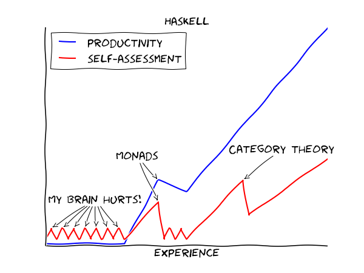

## 首先
> 写多了命令式（面向对象）的语言，去学这样一个函数式编程思维，是有点难度的，但是它确实可以大大的增加的你效率，以及减少你的bug率，用户体验很好，你会很容易的迷上这种编程思维。从下面的图可以看出，随着使用经验的增长，你的产出效率，和自我评价的变化...

 ## 本质
 ### 图灵机
是数学家图灵在 1936 年提出的一种抽象计算模型，它的基本思想是用机器来模拟人们用纸笔进行数学运算的过程，从而创造出一台能够模拟人类所能进行的任何计算过程的机器。但是由于历史原因（比如设备的推广造价等），这种机器并没有推广开来，而是我们现在用的这种计算机模型（冯诺依曼）。

### λ演算
它是一套用于研究函数定义、函数应用和递归的形式系统。如果说图灵机产生的是一种思想，那λ演算可是鼻祖了，对之后的函数式语言产生了巨大影响。

### 跟命令式（过程化）的区别
命令式是模拟计算机机器的系统结构，通过计算机指令的顺序排列，告诉计算机如何进行计算工作。它的特点就是自上而下的分析问题，分步骤的解决问题。而函数式是数学上的抽象，把计算用数学表达式描述出来，从而求值。

## 概念
- 函数这个词指的是数学中，自变量的映射，是变量和自变量的一对一，而不是 function 这个概念。
- 一个函数的值仅仅由函数参数的值决定，不依赖于其他状态。
- 函数式编程中，函数是一等公民，任何演算都可以用函数来表达。函数可以做为参数，也可以作为返回值。
- 函数式中的变量，不同于命令式中的变量，没有存储单元，而是代数值，只是一个名词（变量）。
- 变量值是不可变的，比如 x = x + 1 是不成立的，因为在数学上是没有这样的等式的。
- 循环语句，条件语句也不是命令式编程的控制语句，而是函数的语法糖。比如循环就是通过递归去模拟的。